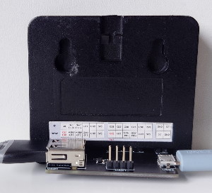
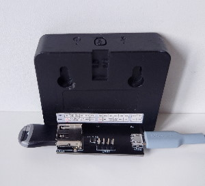
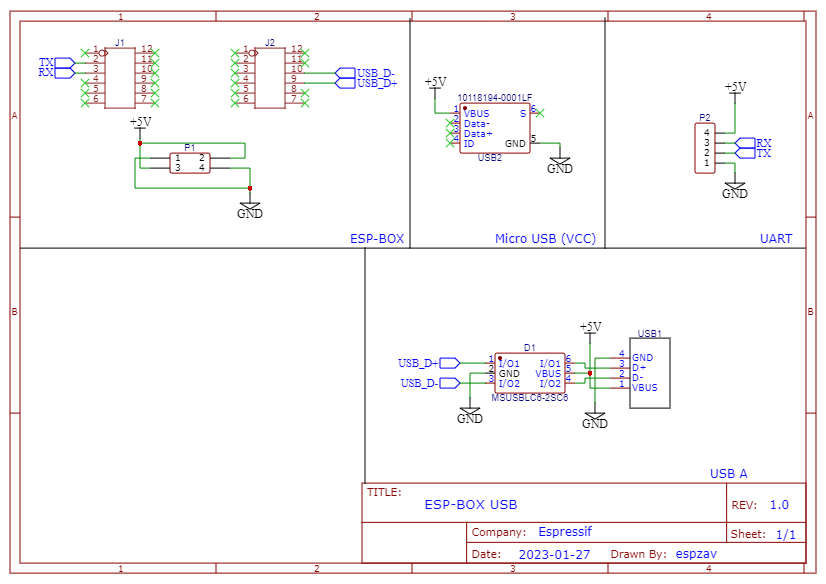

| Supported Targets | ESP-BOX (ESP32-S3) |
| ----------------- | ------------------ |

# UVC Camera and MSC LVGL Example

This example shows video from USB (UVC) camera into canvas in LVGL. There can be changed size of video and canvas in settings tab on the screen. The size can be changed only to lower size. 

On second tab, there is list of files and directories, when USB drive connected. When selected *.txt file, it shows content in a new window. When selected *.jpg image, it shows image in a new window. For files *.wav it shows media player.

## Screenshots

|  Camera tab  | USB drive tab | Settings tab |
| :----------: | :-----------: | :----------: |
|  |  |  |

|  Image window  |   Media player window | Text file window |
| :------------: | :-------------------: | :--------------: |
|  |  |  |

## How to use the example

### Hardware Required

* ESP-BOX
* USB (UVC) Camera
* USB Drive
* USB cable with bare wires on one side

### Camera connection

|  USB-A Female  |   ESP32-S3 |
| :------------: | :--------: |
|   VCC 5V (red) |     5V     |
|   D- (white)   |   GPIO 19  |
|   D+ (green)   |   GPIO 20  |
|   GND (black)  |     GND    |

### USB/UART connection

|    USB/UART    |   ESP32-S3 |
| :------------: | :--------: |
|   VCC 5V       |     5V     |
|     RXD        |   GPIO 44  |
|     TXD        |   GPIO 43  |
|     GND        |     GND    |


### Compile and flash

```
idf.py -p COMX flash monitor
```

Note 1: Before flashing firmware, there should be manually switched into BOOT mode: Hold BOOT button on ESP-BOX and push restart button. 

Note 2: There cannot be used USB-C simultaneously with camera. The ESP-BOX must be powered from pins on the bottom side!

### Recommended USB connection with custom board

 

This is a custom board which was made for connecting USB devices to ESP-BOX. All source files are saved in [this folder](doc/hardware/).



